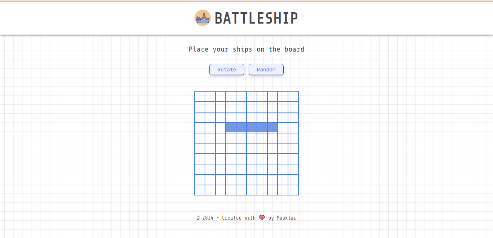

# Battleship



**Live demo:** [https://battleship-mk.vercel.app](https://battleship-mk.vercel.app)

## Project Summary
This project exercise, created by The Odin Project, is an application of the game Battleship. This project is created using Test Driven Development (TDD) practices, specifically unit tests, with Jest. DOM manipulation is not tested for this project, only the application logic.

## Features Overview

* Ship Placement
* Ship Orientation and Placement
* Resetting the Board
* Starting the game
* Markers - hit and miss

## How to install

```bash
git clone 'https://github.com/mooktardev/odin-battleship'

cd odin-battleship

npm install
```
You can start the development server by running `npm run dev` or build for production with
`npm run build`.


## How to Play

1. Place your battleships weither horizontaly or verticaly. You can set them randomly if you want instead.
2. Ater placing, you can begin playing! To make attack the enemy, click any cell on their board. As you attack, the enemy will simultaneously attack your board and attempt to hit your ships.
3. To win the game, sink all the enemy ships before they sink yours! To sink an enemy ship, you must hit all the cells that contain that ship.

## License

MIT